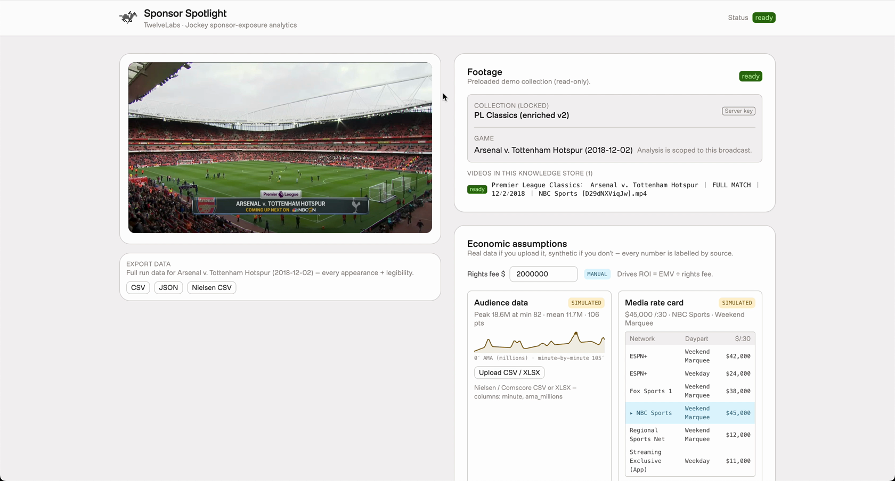
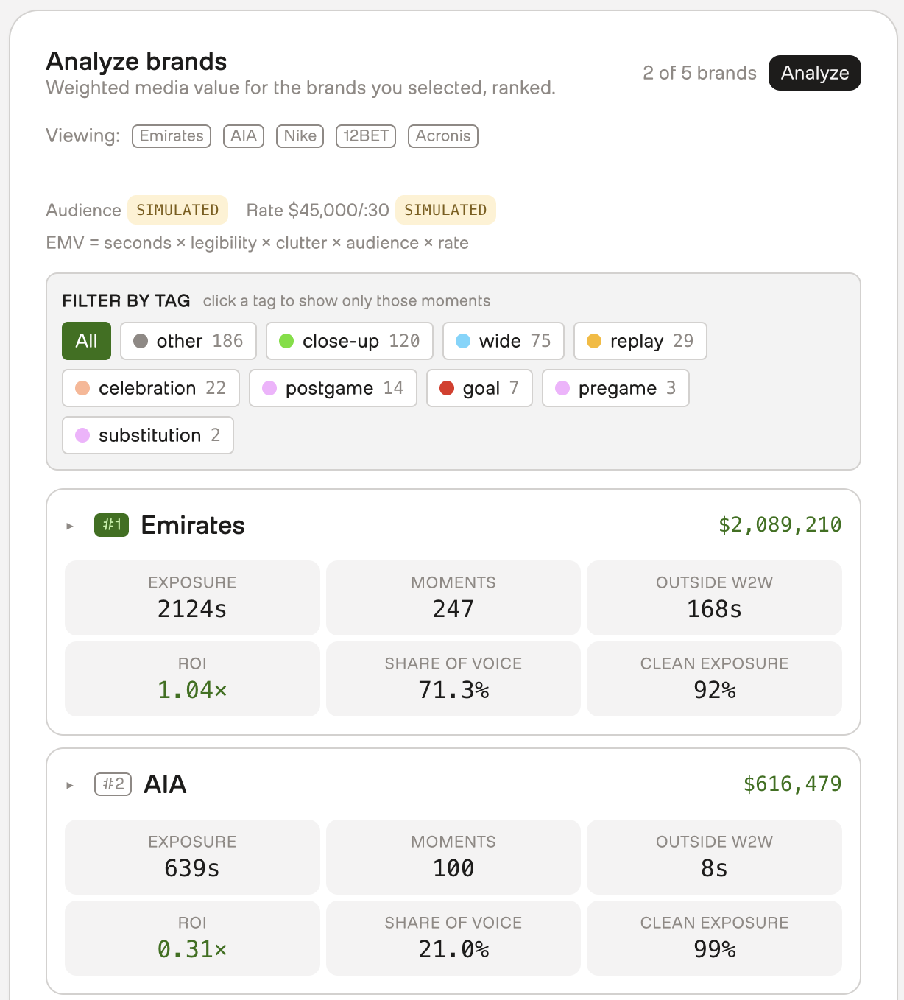
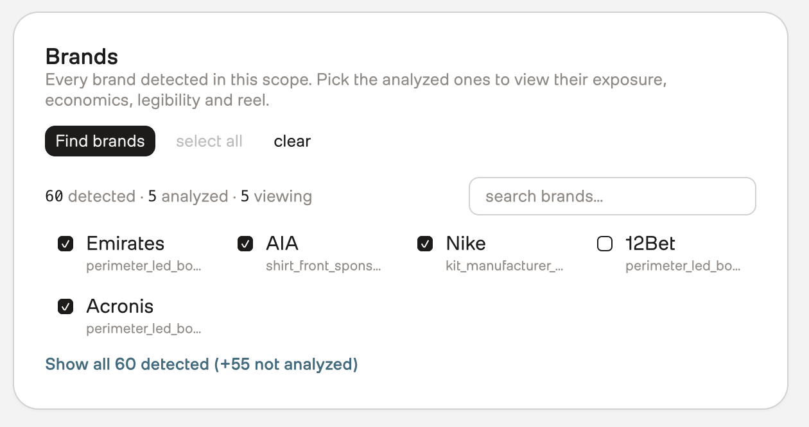
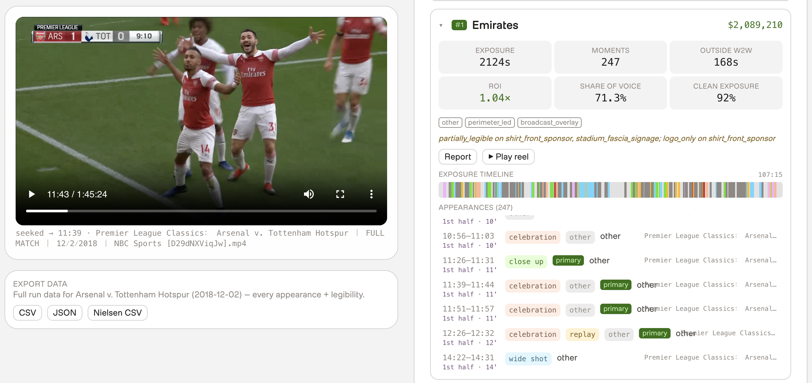
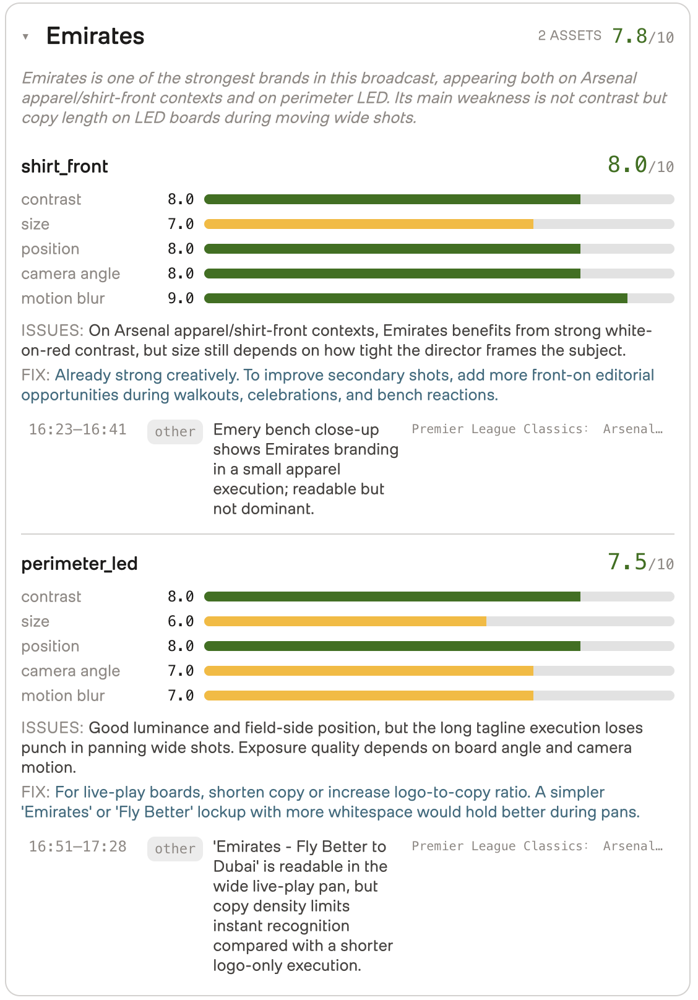
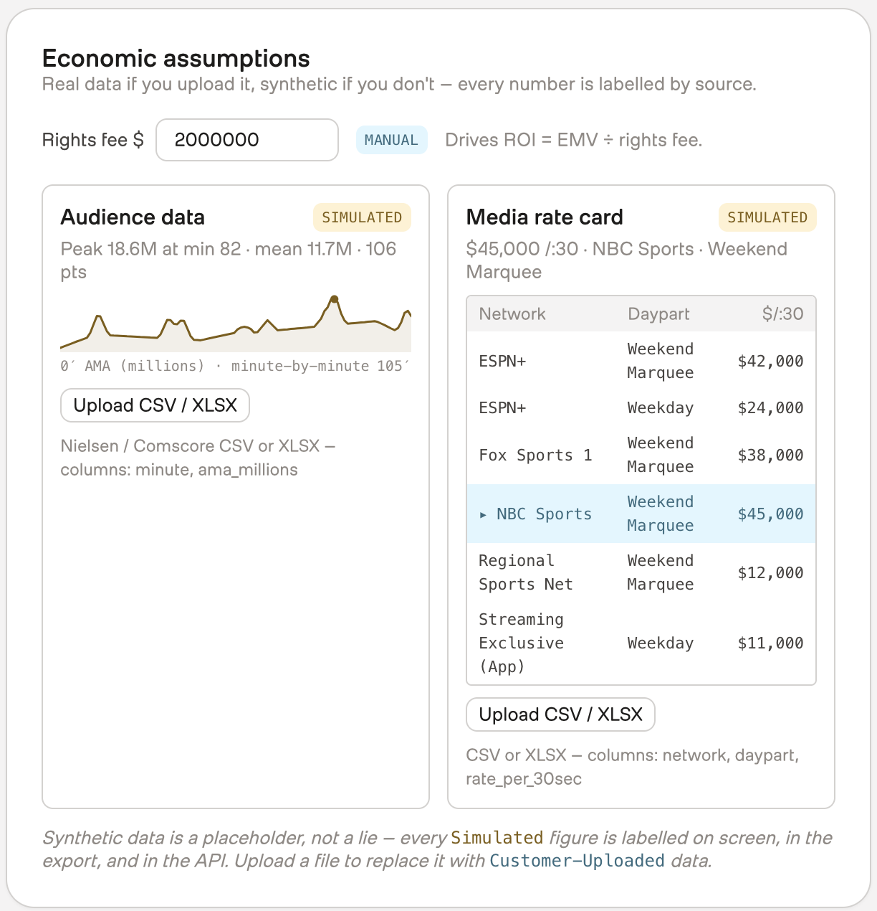

# Building a Sponsor Intelligence App with TwelveLabs Jockey

Use Jockey to discover brands, measure exposure, connect sponsorships to match events, and evaluate creative performance across a full sports broadcast.

## TL;DR

This tutorial builds a sponsor intelligence application with **TwelveLabs Jockey**. The system discovers visible brands across a broadcast, measures each appearance, connects exposure to match events, evaluates creative legibility, and turns the structured results into an interactive sponsor report.

Applied to one NBC Sports broadcast of Arsenal against Tottenham Hotspur, Jockey discovered **60 distinct brands** with no watchlist configured in advance. Five brands were selected for deeper analysis, producing **375 timestamped appearances**, **6 goal windows**, **27 celebration windows**, and **62 replay windows**. Every appearance included a source filename, match period, and scorebug clock.

What you will build:

1. A **Brand Identifier** that finds visible sponsors across the full broadcast.
2. An **Exposure Tracker** that records each appearance with timestamps, duration, placement, framing, and source attribution.
3. A **Match Context Engine** that connects sponsor exposure to goals, celebrations, and replays.
4. A **Creative Quality Auditor** that scores legibility and returns timestamped recommendations.
5. A **Sponsor Valuation Dashboard** that calculates estimated media value and supports filtering, playback, and exports.

[](../media/sponsor-spotlight-demo.mp4)

*A short walkthrough of the finished application. [Play the video](../media/sponsor-spotlight-demo.mp4).*


*Figure 1: The finished report — brands ranked by estimated media value, with every economic input labelled by source.*

---

## Introduction

A sponsor report needs more than total screen time. To explain what a brand received from a broadcast, the system needs to answer four questions:

1. **Coverage:** Which brands appeared, and on which surfaces?
2. **Context:** What was happening in the match when each appearance occurred?
3. **Creative quality:** How clearly did each placement render on air?
4. **Provenance:** Which exact moment in the source footage supports each result?

Jockey provides the video understanding required for all four. It can discover brands without a predefined watchlist, read the scorebug while tracking sponsor signage, identify goals and replays in dedicated event passes, and evaluate how camera angle, motion, contrast, and copy length affect legibility.

The application turns those observations into structured data that can be filtered, compared, valued, and opened directly in the source video.

---

## The Sponsor Intelligence Stack

The application asks Jockey four focused questions. Each one produces a different layer of sponsor intelligence.

| Component | Question for Jockey | Structured output |
|---|---|---|
| **Brand Identifier** | Which brands appear anywhere in the broadcast? | Brand names and placement types |
| **Exposure Tracker** | Where does this brand appear, and what is happening on screen? | Timestamps, duration, placement, framing, match period, scorebug clock, and source video |
| **Match Context Engine** | Where do goals, celebrations, and replays occur? | Precise event windows with teams, descriptions, and confidence |
| **Creative Quality Auditor** | How well does each placement render on air? | Per-placement scores, issues, recommendations, and timestamped examples |

Each component asks Jockey a focused question and defines the answer with a JSON schema.

```text
POST https://api.twelvelabs.io/v1.3/responses
```

Jockey returns structured video intelligence. Deterministic code handles interval joins, overlap removal, and valuation arithmetic.

---

## Analyze Once, Explore Instantly

Each pass reasons across the complete broadcast. The application analyzes it once and saves the structured observations. The report can then rank brands, filter to goals or replays, recalculate media value, generate exports, and seek directly into the source footage.

```text
BROADCAST ANALYSIS                            INTERACTIVE APPLICATION
────────────────────────────────────          ─────────────────────────────
upload + enrich    → Knowledge Store
four Jockey passes → structured JSON  ─────▶  loads measured results
                                              calculates economics in-browser
```

The result combines deep video reasoning with instant exploration:

- **Jockey analyzes** the complete broadcast.
- **The application explores** the structured results from every angle.

---

## Prerequisites

You will need a TwelveLabs account, an API key with access to `jockey1.0`, and a sports broadcast video.

---

# Build the Sponsor Intelligence Pipeline

## Step 1: Upload and Enrich the Broadcast

Jockey reasons over assets inside a Knowledge Store, so the footage has to get there first. That is three API calls.

Upload the broadcast and keep the asset ID it returns:

```python
asset_id = await jockey.upload_asset_file("match.mp4")   # POST /v1.3/assets
```

Create the Knowledge Store. The enrichment description is the highest-leverage choice here: it tells Jockey which sponsor surfaces and broadcast contexts deserve attention before any analysis request runs.

```python
# POST /v1.3/knowledge-stores
body = {
    "name": name,
    "ingestion_config": {
        "enrichment_config": {
            "type": "description",
            "description": description,
        }
    },
    "metadata": metadata,
}
```

Then attach the broadcast and wait for it to finish indexing:

```python
item_id = await jockey.add_item(store_id, asset_id)   # POST /v1.3/knowledge-stores/{id}/items
item = await jockey.wait_for_item(store_id, item_id, timeout_s=10800)
```

For soccer, the enrichment description names the full sponsor environment, including shirt fronts, sleeves, perimeter boards, stadium fascia, scoreboards, interview backdrops, broadcast overlays, and commercials:

```python
# backend/pre_processing/ingest_assets.py
ENRICHMENT = (
    "This is a soccer (association football) broadcast. Extract every visible "
    "sponsor, advertiser, and brand and where each one appears. Sponsor surfaces "
    "in soccer broadcasts include: rotating and static perimeter LED advertising "
    "boards around the pitch; shirt-front sponsors; shirt-sleeve sponsors; kit "
    "manufacturer logos (e.g. Nike, adidas, Puma swooshes/marks); shorts and "
    "training-kit sponsors; stadium fascia, stand and tunnel signage; big-screen "
    "and scoreboard advertisements; goal-net, corner-flag and substitution-board "
    "branding; flash-interview and press-conference backdrops; broadcast graphics, "
    "lower-thirds, the scorebug and on-screen bug/ident overlays; and in-broadcast "
    "commercials. For each appearance capture the brand name, the surface/placement "
    "type, the broadcast context (open play, goal, celebration, replay, close-up, "
    "wide shot, pregame, halftime, postgame, substitution, commercial), and how "
    "prominent and legible the logo is. Include small, partial, briefly-visible, "
    "angled, or background logos — not only large foreground ones. Read and "
    "transcribe brand wordmarks even when only partially visible."
)
```

The final sentence is especially useful. It explicitly includes small, partial, briefly visible, angled, and background marks. That is how the Brand Identifier reaches beyond the most obvious foreground logos.

---

## Step 2: Give Jockey the Vocabulary of the Sport

Sponsor surfaces change by sport. Soccer has perimeter LED boards and shirt fronts. Basketball has scorer's tables and backboards. Hockey has dasher boards and center-ice logos.

The application defines that vocabulary once and uses it in both the prompts and schemas:

```python
# backend/sports.py
def _profile(
    label,
    surfaces_phrase,
    enrichment_lead,
    contexts,
    event_kinds,
    asset_types,
):
    ...

"soccer": _profile(
    label="Soccer / Football",
    surfaces_phrase=(
        "rotating and static perimeter LED advertising boards around the pitch; "
        "shirt-front sponsors; shirt-sleeve sponsors; kit manufacturer logos; ..."
    ),
    enrichment_lead="This is a soccer (association football) broadcast.",
    contexts=(
        "open play, goal, celebration, replay, close-up, wide shot, "
        "pregame, halftime, postgame, substitution, commercial, other"
    ),
    event_kinds=[
        {
            "kind": "goal",
            "phrase": "a goal is scored — the ball crosses the goal line",
        },
        {
            "kind": "celebration",
            "phrase": "players or fans celebrate a goal",
        },
        {
            "kind": "replay",
            "phrase": "a slow-motion replay of a goal or key incident is shown",
        },
    ],
    asset_types=[
        "perimeter_led",
        "shirt_front",
        "shirt_sleeve",
        "kit_manufacturer",
        "shorts",
        "stadium_fascia",
        "big_screen",
        "goal_net",
        "corner_flag",
        "substitution_board",
        "interview_backdrop",
        "broadcast_overlay",
        "commercial",
        "other",
    ],
),
```

The schema is rebuilt with the selected sport's asset types:

```python
# backend/domain/sponsor/schemas.py
def per_brand_schema(sport: str | None = None) -> dict[str, Any]:
    """Return PER_BRAND_SCHEMA with the surface vocabulary for sport."""
    return _with_asset_types(
        PER_BRAND_SCHEMA,
        asset_types_for(sport),
    )
```

This keeps the natural-language question and the permitted structured values aligned. Adding another sport becomes a profile change rather than a new analysis pipeline.

---

## Step 3: Scope Jockey to One Broadcast

A Knowledge Store can contain several games. `selections` lets the application point Jockey at one specific broadcast:

```python
# backend/services/scoping.py
async def game_selections(store_id: str, game_id: str | None) -> list[dict[str, Any]] | None:
    if not games.by_id(game_id):
        return None                      # aggregate scope: nothing to select
    items: list[dict[str, Any]] = []
    try:
        items = await jockey.list_items(store_id)
    except Exception as e:
        log.warning("selections: list_items failed for %s: %s", store_id, e)
    item_id = games.resolve_item_id(game_id, items)
    if not item_id:
        return None
    return [{"kind": "item", "id": item_id}]
```

The prompt binds that selected item through `{{sel:0}}`:

```python
# backend/domain/sponsor/prompts.py
def game_scope_phrase(game_id: str | None) -> str:
    game = games.by_id(game_id)
    return (
        f"\n\nAnalyze ONLY this single broadcast: "
        f"{{{{sel:0}}}} ({game['label']}). "
        f"Ignore every other video in the knowledge store. "
        f"Set each moment's `video` field to this broadcast's filename.\n"
    )
```

Every returned appearance is also asked to name its source file. In this analysis, all **375 appearances** included a source filename, match period, and scorebug clock. Those fields make every metric traceable back to the footage.

---

## Step 4: Build the Brand Identifier

The Brand Identifier starts with a broad question:

> Which brands appear anywhere in this broadcast?

It returns names and placement types; detailed timestamps come next.

```python
# backend/domain/sponsor/prompts.py
def discovery_message(
    surfaces_phrase: str,
    scope: str,
) -> str:
    return (
        "List every distinct sponsor brand visible anywhere in this broadcast — "
        f"across these surfaces: {surfaces_phrase}. "
        "Be thorough; surface even small or briefly-visible logos. "
        "For each brand return ONLY: name and asset_types[]. "
        "Do NOT enumerate timestamps in this pass. "
        "End with a one-sentence `summary` of the sponsorship landscape."
        + scope
    )
```

The schema matches that focused request:

```python
# backend/domain/sponsor/schemas.py
DISCOVERY_SCHEMA = {
    "name": "brand_discovery",
    "schema": {
        "type": "object",
        "properties": {
            "brands": {
                "type": "array",
                "description": (
                    "Every distinct sponsor brand visible anywhere in the "
                    "broadcast. Be thorough but quick; do NOT enumerate "
                    "timestamps in this pass."
                ),
                "items": {
                    "type": "object",
                    "properties": {
                        "name": {"type": "string"},
                        "asset_types": {
                            "type": "array",
                            "items": {"type": "string"},
                            "description": (
                                "Surfaces this brand appears on, using the "
                                "sport vocabulary from the prompt."
                            ),
                        },
                    },
                    "required": ["name"],
                },
            },
            "summary": {"type": "string"},
        },
        "required": ["brands"],
    },
}
```

Every Jockey component uses the same request structure, with a different prompt and JSON schema:

```python
# backend/jockey.py
body = {
    "model": "jockey1.0",
    "instructions": instructions,
    "input": [
        {
            "type": "message",
            "role": "user",
            "content": user_message,
        }
    ],
    "knowledge_store_id": knowledge_store_id,
}

if selections:
    body["selections"] = selections

if json_schema:
    body["text"] = {
        "format": {
            "type": "json_schema",
            "name": json_schema["name"],
            "schema": json_schema["schema"],
        }
    }

response = await client.post(
    f"{BASE_URL}/responses",
    headers={"x-api-key": key},
    json=body,
)
```

The response arrives as schema-constrained JSON:

```python
# backend/jockey.py
def extract_json(response: dict[str, Any]) -> tuple[str, Any]:
    """(text, parsed) for a schema-constrained /responses call.

    `parsed` is None when the payload had no text, or the model returned
    something that isn't valid JSON despite the json_schema.
    """
    text = extract_text(response)  # response["output"][0]["content"][0]["text"]
    if not text:
        return text, None
    try:
        return text, json.loads(text)
    except json.JSONDecodeError:
        return text, None
```

On the Arsenal–Tottenham broadcast, Jockey returned **60 distinct brands**.

A sample of the inventory:

```json
{
  "brands": [
    {
      "name": "12BET",
      "asset_types": [
        "perimeter_led_board_rotating",
        "perimeter_led_board_static"
      ]
    },
    {
      "name": "AIA",
      "asset_types": [
        "shirt_front_sponsor",
        "stand_signage"
      ]
    },
    {
      "name": "Puma",
      "asset_types": [
        "kit_manufacturer_logo",
        "perimeter_led_board_rotating",
        "stadium_fascia_signage"
      ]
    },
    {
      "name": "Lexus",
      "asset_types": [
        "broadcast_graphic",
        "on_screen_ident",
        "scorebug"
      ]
    },
    {
      "name": "Acronis",
      "asset_types": ["perimeter_led_board_rotating"]
    }
  ]
}
```


*Figure 2: Sixty brands discovered, with five selected for detailed analysis.*

Discovery also reveals the brands competing for attention beyond the rights holder's own sponsors. Arsenal sold Emirates inventory, but AIA, Nike, Lexus, Puma, Visit Rwanda, Premier League, and other marks still appeared in the same broadcast. Starting with the video produces the full visible field rather than a list configured in advance.

---

## Step 5: Build the Exposure Tracker

The Exposure Tracker takes one discovered brand and asks Jockey for every distinct appearance.

Selected brands can be analyzed in parallel:

```python
# backend/services/analyze.py
results = await asyncio.gather(*(
    fetch_brand_appearances(
        name,
        store_id,
        sport,
        videos,
        game_id,
        selections,
        asset_label,
    )
    for name in brand_names
))
```

The prompt asks for timestamps, total duration, placement type, framing, event context, confidence, source video, match period, and the exact game clock shown on screen:

```python
# backend/domain/sponsor/prompts.py
def per_brand_message(brand_name: str, scope: str) -> str:
    return (
        f"Focus ONLY on the sponsor brand '{brand_name}'. Return:\n"
        f"  - name: '{brand_name}'\n"
        f"  - total_seconds visible across the broadcast\n"
        f"  - moments_count\n"
        f"  - outside_whistle_to_whistle_seconds (pregame, halftime, postgame, timeouts)\n"
        f"  - asset_types: every surface it appears on\n"
        f"  - appearances[]: every distinct exposure with start_sec, end_sec, "
        f"view (how it's framed: close_up / wide_shot / other — a single value), "
        f"events (what's happening in the match at that moment: goal, celebration, "
        f"replay, pregame, halftime, postgame, timeout, substitution, commercial — "
        f"zero or more; leave empty if nothing notable is happening), "
        f"asset_type, brief description, confidence, source video filename, "
        f"placement (primary = large/sharp/foreground, secondary = small/background), and — "
        f"read from the on-screen scorebug — the match period (first half / halftime / "
        f"second half / stoppage / pre/postgame) and the game_clock exactly as shown "
        f"(e.g. 23:31, 45:00, 01:07:34). Include all appearances you can identify; do not cap.\n"
        f"  - legibility_notes if it renders poorly anywhere."
        + scope
    )
```

Five selected brands produced **375 timestamped appearances**:

| Brand | Exposure | Appearances | Outside live play |
|---|---:|---:|---:|
| Emirates | 2,124 seconds | 247 | 168 seconds |
| AIA | 639 seconds | 100 | 8 seconds |
| 12BET | 286 seconds | 18 | 0 seconds |
| Nike | 37 seconds | 8 | 0 seconds |
| Acronis | 18 seconds | 2 | 0 seconds |

One returned appearance looked like this:

```json
{
  "start_sec": 2166.0,
  "end_sec": 2176.0,
  "asset_type": "other",
  "placement": "secondary",
  "view": "other",
  "events": ["goal"],
  "period": "first half",
  "game_clock": "36:06",
  "confidence": 0.98,
  "description": "stadium_fascia_signage: Harry Kane takes the penalty and scores, sending Bernd Leno the wrong way. The match clock shows 34:00 and the score becomes Arsenal 1-2 Tottenham",
  "video": "Premier League Classics: Arsenal v. Tottenham Hotspur | FULL MATCH | 12/2/2018 | NBC Sports.mp4"
}
```

The result contains far more than a timestamp: the play, the players involved, the score change, the match period, the game clock, the placement, and the source file.


*Figure 3: Each band is one timestamped appearance. Selecting one opens the broadcast at that moment, and every row carries the match period and the clock Jockey read from the scorebug.*

---

## Step 6: Build the Match Context Engine

Sponsor exposure becomes more useful when it is connected to what the audience was watching.

The Match Context Engine asks separately for every goal, celebration, and replay:

```python
# backend/domain/sponsor/prompts.py
def event_windows_message(
    phrase: str,
    scope: str,
) -> str:
    return (
        f"Identify EVERY moment in this broadcast where {phrase}. "
        f"For each occurrence return a window with precise start_sec and end_sec "
        f"(seconds from the video start), the team involved if identifiable, a "
        f"brief description, a confidence 0-1, and the source video filename. "
        f"Be exhaustive — list every occurrence, do not cap or summarize away any."
        + scope
    )
```

For soccer, the three event questions returned:

| Event | Windows found |
|---|---:|
| Goals | 6 |
| Celebrations | 27 |
| Replays | 62 |

A goal window returned this description:

```json
{
  "kind": "goal",
  "start_sec": 693.0,
  "end_sec": 698.0,
  "team": "Arsenal",
  "confidence": 0.99,
  "description": "Pierre-Emerick Aubameyang scores Arsenal's opening goal from the penalty spot, sending Hugo Lloris the wrong way and hitting the back of the net.",
  "video": "Premier League Classics: Arsenal v. Tottenham Hotspur | FULL MATCH | 12/2/2018 | NBC Sports.mp4"
}
```

Jockey identified Pierre-Emerick Aubameyang's penalty, the team, the scoring action, the precise video window, and a confidence of **0.99** from a question that only asked where goals occurred.

The application joins event windows to sponsor appearances by interval overlap:

```python
# backend/pre_processing/capture_demo_cache.py
# OFFLINE ONLY

def _stamp_events(
    appearances: list[dict],
    windows: list[dict],
) -> None:
    """Union model events with event kinds from overlapping windows."""
    for appearance in appearances:
        start = float(appearance["start_sec"])
        end = float(appearance["end_sec"])

        model_events = {
            str(value).strip().lower()
            for value in (appearance.get("events") or [])
        }

        overlapping_events = {
            window["kind"]
            for window in windows
            if _overlaps(
                start,
                end,
                window["start_sec"],
                window["end_sec"],
            )
        }

        appearance["events"] = sorted(
            model_events | overlapping_events
        )
```

After the join, **71 of 375 appearances** carried at least one match-event tag. The remaining appearances correctly stayed untagged when no goal, celebration, or replay overlapped the exposure window.

Jockey supplies the event understanding; deterministic code makes the temporal join repeatable.

---

## Step 7: Build the Creative Quality Auditor

The Creative Quality Auditor asks a different question:

> Was the sponsor merely present, or did the creative actually work on air?

Jockey scores each placement on contrast, apparent size, screen position, camera angle, resistance to motion blur, and overall legibility. It also returns issues, recommendations, and timestamped examples.

```python
# backend/domain/sponsor/prompts.py
def legibility_message(brands: list[str], surfaces_phrase: str, scope: str) -> str:
    return (
        f"Produce a CREATIVE & VISIBILITY audit for these sponsor brands across the broadcast:\n"
        f"{', '.join(brands)}\n\n"
        f"Visual hints:\n{brand_hints(brands)}\n\n"
        f"For EACH brand, evaluate every asset type they appear on "
        f"({surfaces_phrase}). For each asset, score 0-10 on: contrast, "
        f"size, position, camera_angle, motion_blur, and overall_score. Cite "
        f"specific timestamped examples in `examples` where the asset rendered "
        f"poorly. In `suggestions`, recommend concrete creative or placement "
        f"fixes (e.g. 'increase contrast — current navy-on-charcoal loses "
        f"detail in wide shots; switch to white outline')."
        + scope
    )
```

The schema turns that visual judgment into structured data:

```python
# backend/domain/sponsor/schemas.py
LEGIBILITY_SCHEMA = {
    "name": "legibility_report",
    "schema": {
        "type": "object",
        "properties": {
            "brands": {
                "type": "array",
                "items": {
                    "type": "object",
                    "properties": {
                        "name": {"type": "string"},
                        "assets": {
                            "type": "array",
                            "items": {
                                "type": "object",
                                "properties": {
                                    "asset_type": {
                                        "type": "string",
                                        "enum": ASSET_TYPES,
                                    },
                                    "overall_score": {
                                        "type": "number",
                                        "description": "Overall legibility 0-10 (10 = perfectly readable)",
                                    },
                                    "contrast": {
                                        "type": "number",
                                        "description": "Logo-vs-background contrast 0-10",
                                    },
                                    "size": {
                                        "type": "number",
                                        "description": "Apparent on-screen size 0-10",
                                    },
                                    "position": {
                                        "type": "number",
                                        "description": "Screen position / framing 0-10",
                                    },
                                    "camera_angle": {
                                        "type": "number",
                                        "description": "Camera angle favorability 0-10",
                                    },
                                    "motion_blur": {
                                        "type": "number",
                                        "description": "Resistance to motion blur 0-10 (10 = no blur)",
                                    },
                                    "issues": {
                                        "type": "string",
                                        "description": "Specific problems observed",
                                    },
                                    "suggestions": {
                                        "type": "string",
                                        "description": "Concrete creative or placement fixes",
                                    },
                                    "examples": {
                                        "type": "array",
                                        "description": "Timestamps illustrating the issue",
                                        "items": {
                                            "type": "object",
                                            "properties": {
                                                "start_sec": {"type": "number"},
                                                "end_sec": {"type": "number"},
                                                "note": {"type": "string"},
                                                "video": {"type": "string"},
                                            },
                                            "required": ["start_sec", "end_sec"],
                                        },
                                    },
                                },
                                "required": ["asset_type", "overall_score"],
                            },
                        },
                        "summary": {"type": "string"},
                    },
                    "required": ["name", "assets"],
                },
            }
        },
        "required": ["brands"],
    },
}
```

The broadcast produced these placement-level results:

| Brand | Placement | Overall legibility |
|---|---|---:|
| Emirates | Shirt front | 8.0 |
| Emirates | Perimeter LED | 7.5 |
| AIA | Shirt front | 7.0 |
| 12BET | Perimeter LED | 7.0 |
| Nike | Other | 6.0 |
| Acronis | — | No score returned |

Scoring each placement separately reveals the difference between the shirt-front execution and the perimeter board that a single brand-level score would hide.

Jockey explained the lower perimeter score:

> **Issue:** Strong luminance and field-side placement, but the long tagline loses impact during panning wide shots. Readability depends on board angle and camera motion.
>
> **Recommendation:** Shorten the live-play copy or increase the logo-to-copy ratio. A simpler Emirates or Fly Better lockup with more whitespace would remain recognizable during pans.
>
> **Example, 16:51–17:28:** “Emirates - Fly Better to Dubai” remains readable, but the copy density limits immediate recognition compared with a shorter logo-led execution.


*Figure 4: Per-placement scores, issues, recommendations, and timestamped evidence.*

This is art direction grounded in how the creative behaved through real camera movement at a specific point in the footage.

Only `overall_score` feeds valuation. The component scores explain why the number moved and which creative or placement decision could improve it.

---

# Turn the Analysis into a Sponsor Report

Jockey's four passes produce the measurement. The structured results then power valuation, filtering, exports, and timestamped playback without additional model calls:

| Brand | Exposure | Appearances | Estimated media value |
|---|---:|---:|---:|
| Emirates | 2,124 seconds | 247 | $2,089,210 |
| AIA | 639 seconds | 100 | $616,479 |
| 12BET | 286 seconds | 18 | $188,752 |
| Nike | 37 seconds | 8 | $24,172 |
| Acronis | 18 seconds | 2 | $11,550 |

Audience curves and rate cards are business inputs rather than video observations, so the interface labels every one of them **Customer-Uploaded**, **Simulated**, or **Manual**. Measured video evidence and commercial assumptions stay visibly separate.


*Figure 5: Each economic input displays its source.*

## From Broadcast Footage to Sponsor Intelligence

The finished report does more than total sponsor seconds. It turns a full broadcast into a structured dataset of brands, appearances, match events, placement quality, and creative performance.

Jockey discovered 60 brands without a watchlist, returned 375 timestamped appearances across five selected sponsors, identified 6 goals, 27 celebrations, and 62 replays, and produced placement-specific creative recommendations from the video itself.

Every measured appearance carries the source filename, match period, and scorebug clock. That makes each result directly traceable to the footage, whether the user is reviewing a valuation, comparing creative executions, or opening a goal-tagged exposure in the player.

Jockey turns the broadcast into sponsor intelligence that is measurable, explainable, and immediately explorable.

---

## Resources

- [TwelveLabs Jockey](https://www.twelvelabs.io/jockey) — product overview and access
- [Create a response](https://beta.docs.twelvelabs.io/v1.3/agents/get-started/quickstart/create-a-response) — generate structured answers from a Knowledge Store
- [Search a Knowledge Store](https://beta.docs.twelvelabs.io/v1.3/agents/guides/search-a-knowledge-store) — retrieve timestamped moments with natural-language queries
- [TwelveLabs Playground](https://playground.twelvelabs.io) — upload assets and work with Knowledge Stores
- [Sponsor Spotlight source](https://github.com/Teraflop-Inc/twelve-labs-sponsor-spotlight) — the prompts and schemas in `backend/domain/sponsor/` are the whole contract with Jockey
